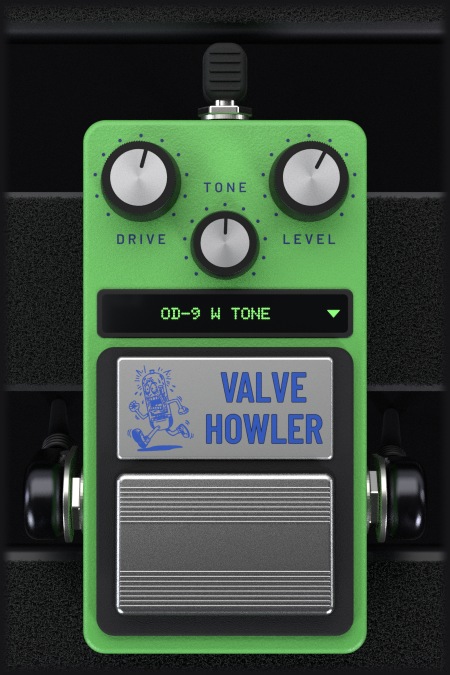

# Valve Howler

<p align="center"></p>

Valve Howler is a **smooth overdrive** for guitar and bass that runs on Linux as a
mono **LV2** plugin, with its own rendered interface. It is the classic
valve screamer-style circuit, modelled from the schematic rather than fitted to a
curve or captured from a unit: every stage is derived from the components and their
equations, and its coefficients are generated from the netlist.

This is an independent product and is **not affiliated with, endorsed by, or
connected to any pedal manufacturer**. The variant names describe circuit
topology, not brands.

---

> **Full disclosure: This plugin was vibe-coded.**
>
> Valve Howler was developed by a musician/audio engineer ([NiLace](https://github.com/NiLace)) directing [Claude](https://claude.ai) (Anthropic's AI) through natural language conversation. The author described what the plugin should do, how it should sound, and how it should look. Claude wrote the C++ code, the DSP algorithms, the UI rendering, the build system, and this README.
>
> The author is not a professional programmer, though he can read C++. Every line of code in this project was generated by AI, then tested and validated by the author in real-world audio production with [Ardour](https://ardour.org) on Linux.
>
> If AI-generated code is a concern for you, this is your notice. The plugin works and it sounds good — but you should know how it was made.

---

## What it does

It's the overdrive that made the sound of a thousand records: a mild, sweet
clipping with a strong midrange hump — more a push into the front of an amp than a
distortion in its own right. Turn the drive up and it thickens and compresses
rather than tearing; back it off and it works as a clean boost with attitude.

The model comes from the circuit, so the controls behave the way the hardware's do
rather than the way three independent DSP blocks would. The tone control's corner
moves with the drive, the output stage loads the tone stage, the supply rail moves
under the signal — none of that is added flavour, it falls out of solving the same
network the pedal is. The arbiter throughout development was **ngspice** running
the same netlist: not a listening test, and not a capture of somebody's unit.

The non-linear part runs at **4× internally** so its harmonics don't fold back into
the audible band. That costs **31 samples** of latency at any session rate (0.65 ms at 48 kHz); the
plugin reports it and the host compensates. The resampling filters are long enough
to keep the top octave: the 17th and 19th harmonics of a 1 kHz note (18 and 20 kHz)
come out within 0.6 dB of the same plugin run at 192 kHz.

## The front panel

Three knobs and a footswitch, like the pedal:

- **Drive** — how hard the signal is pushed into the clipping stage. At the low end
  it's a clean boost; at the top it's thick and compressed.
- **Tone** — the treble tilt after the clipping stage. Turning it up opens the top
  end; turning it down rolls it off and leaves the midrange hump alone.
- **Level** — the output volume.
- The **footswitch** is the bypass. It is wired to the host's standard *enabled*
  control, so the host understands it as a bypass and can automate it, rather than
  it being an invented toggle only this plugin knows about. Engaged, the name and the
  knob labels are printed in blue; bypassed, they fade to grey and the variant
  display goes dark.

Drag a knob up or down to set it, or use the mouse wheel. Between the knobs and the
footswitch is the **variant display**: click it to choose a variant. While the pedal
is bypassed it lights up under the mouse, so a variant is never picked blind.
The box takes the colour of the circuit the variant uses.

Two details worth knowing about the bypass. The dry signal leaves **delayed by the
same 31 samples** the plugin reports — deliberately, so that mixing in parallel with
a dry path stays aligned instead of eating a comb filter. And it crossfades over
about 10 ms rather than switching hard, because the engine's resting output isn't
zero and a hard jump would click.

## The variants

Four rows, and they are two circuits crossed with two laws for the tone knob:

| | |
|---|---|
| **OD-8 W Tone** | the earlier output pair, with the real pot's taper |
| **OD-9 W Tone** | the later output pair, with the real pot's taper |
| **OD-8 L Tone** | the earlier output pair, with the tone travel evened out |
| **OD-9 L Tone** | the later output pair, with the tone travel evened out |

The two **circuits** differ in the pair of resistors at the output. It is a subtle
difference — a slightly different output level and load — not a different pedal.

**W** is the taper of the real potentiometer, and it is the default: faithful, but
that means the circuit crams most of its tone range into the last part of the
sweep. **L** keeps exactly the same circuit and redistributes the knob's travel so
the change per degree of rotation comes out even. It is deliberately *not*
faithful — it is a voicing choice — which is why it lives in its own row instead of
replacing the honest one.

Only the rows whose sources are settled are offered. Where two real models differ
only in a part this model cannot tell apart, they share one row rather than appear
as separate modes that sound identical.

## What it doesn't model

Stated here so it doesn't have to be inferred:

- **The pedal's switching system** — the JFETs and the CMOS flip-flop that do the
  bypass in the hardware — is out of scope. The bypass is the host's, as described
  above. The **input and output buffers are modelled in full**, and those are the
  part that actually colours the signal.
- **The loading of your guitar's pickups.** That happens in the analogue domain
  before the converter, so no plugin can do it. It isn't a shortcoming of this one.

## Installing it

The easy way — no compiler needed. Grab the prebuilt bundle from the
[**Releases**](https://github.com/NiLace/ValveHowler/releases) page and drop it into
your personal LV2 folder:

```sh
mkdir -p ~/.lv2
tar -xzf valvehowler.lv2.tar.gz -C ~/.lv2/
```

That leaves `valvehowler.lv2/` under `~/.lv2/`. Restart your host (or rescan
plugins) and it shows up as **Valve Howler** — in **Ardour** or any other LV2 host
(Carla, Qtractor, Zrythm, REAPER with LV2…). Put it on a **mono** track. To
uninstall, delete the folder. If your host scans a different location, extract
there instead (the system-wide path is usually `/usr/lib/lv2` or
`/usr/local/lib/lv2`).

The bundle is a 64-bit x86 build for Linux. What changed in each version is listed
in [`CHANGELOG.md`](CHANGELOG.md).

## Building from source

You'll need a C++17 compiler, the LV2 development headers, and Cairo, Xlib and
FreeType for the interface. Nothing else is vendored.

```sh
make                                           # plugin + interface + font + images
make install                                   # installs to ~/.lv2/valvehowler.lv2/
make install INSTALL_DIR=/usr/local/lib/lv2    # or wherever your host scans
```

`make install` replaces an installed copy safely, even while a host has the plugin
loaded. `make test` checks that the bundle you just built is complete.

## Third-party components

- **Font** (`assets/fonts/`) — Doto, © The Doto Project Authors, under the SIL Open
  Font License 1.1 (full text beside it). It stays under the OFL and is not relicensed
  under the GPL. It travels inside the bundle because the interface draws the variant
  display with it directly rather than through the system's font configuration.
- **Interface images** (`gui/photo/`, `assets/images/`) — renders of our own 3D scene
  of the pedal, lit with the `studio_small_08` HDRI from
  [Poly Haven](https://polyhaven.com/a/studio_small_08) (CC0). The lettering in the
  renders is set in Barlow, Barlow Condensed and Doto (all SIL Open Font License 1.1).

## How this was made, and the license

This plugin was built mainly with **Claude Code** (Anthropic's AI coding agent),
working from my direction on the DSP, the design, and the testing. I can read C++,
but I have not reviewed every line by hand — so please treat it accordingly:

- **No warranty.** It works in my own testing, but it carries no guarantees of
  any kind.
- **No support.** This is a personal project; I can't promise help, fixes, or
  answers.
- **Help is welcome.** If you read code, spot bugs, or want to improve it, review
  and contributions are genuinely appreciated — that's a big part of why it's open.

Released under the **GNU General Public License v3.0 or later** — see
[`LICENSE`](LICENSE).

## Author

Made by **NL Sounds** — <https://github.com/NiLace> · nilace@nylarea.com
